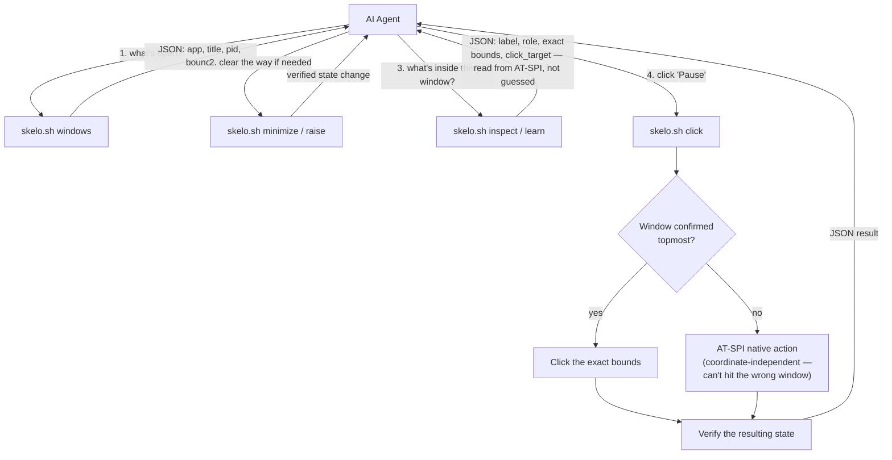

<div align="center">

# Skelo-Linux

**Deterministic desktop automation for AI agents on Linux.**
No screenshots. No pixel-guessing. The agent reads the same accessibility
data the operating system itself uses to draw the screen — so it knows
exactly where a button is, because it never had to guess.

-333?logo=linux&logoColor=white)


</div>

---

## The problem with how most "computer-use" agents see a screen

Most AI desktop agents work the same way: take a screenshot, hand it to a
vision model, ask "where's the Play button," get back a pixel coordinate,
click it, and hope. That coordinate is a **guess** — a statistical estimate
from an image, subject to resolution, compression, occlusion, and
whatever the model's spatial reasoning gets right that day. When it's
wrong, the agent clicks the wrong thing and often can't tell that it did.

Skelo-Linux doesn't do that. Linux desktops already expose a structured,
programmatic map of every window and control on screen — the same
**AT-SPI accessibility tree** screen readers use. Skelo reads that
directly. There is no image, no vision model, and no estimation step
between "where is the button" and "click the button" — the coordinate
Skelo clicks *is* the button's real, current, on-screen bounding box, read
straight from the window system.

| | Screenshot + vision-model agents | Skelo-Linux |
|---|---|---|
| **Where a coordinate comes from** | A model estimates a pixel location from an image | Read directly from the window's real geometry via AT-SPI |
| **What the LLM sees each step** | A full screenshot (has to be re-sent after every action, since the model can't tell what changed otherwise) | A compact, structured JSON list of labeled elements — text, not pixels |
| **Model requirement** | Needs vision capability | Works with any text-only LLM |
| **Click precision** | Approximate — a bounding-box guess from an image | Exact — the same bounding box the window manager itself uses |
| **Detecting "did that actually work"** | Diff two screenshots and infer | Re-read the element/window's real state (AT-SPI state flags, `_NET_WM_STATE`) |
| **Typical per-step payload** | An image (materially larger than a page of text, every step) | A few hundred tokens of structured text |

That last row is the honest way to state the compute difference: images
cost meaningfully more to encode and reason over than the equivalent
structured text does, and a screenshot-based agent has to re-send one on
*every* step just to see what changed. Skelo instead sends small, targeted
JSON — "here are the 12 meaningful elements in this window, with labels
and exact coordinates" — which is both cheaper to process and removes the
guesswork entirely. This is also *why* it doesn't need a vision-capable
model at all: a text-only LLM can read a JSON element list just as well
as a multimodal one can, for a fraction of the cost per step.

The "100% accurate, no screenshots" framing means exactly this: **the
coordinate is never estimated.** It's read from the OS. Whether a given
task *succeeds* end-to-end still depends on picking the right element and
the window being in the state you expect — which is why the rest of this
toolkit exists: identity confirmation before mapping, occlusion-safety
before clicking, and state verification after every window operation, so
each individual step is something the agent can actually trust rather
than something it has to hope worked.

---

## How an agent actually uses it



Every arrow above is real text, not an image — that's the whole point.
The agent never has to "look at the screen" the way a vision pipeline
does; it asks a structured question and gets a structured, exact answer.

---

## Reliability, built in (not bolted on)

- **Identity confirmation before mapping.** `map_app.py` cross-checks the
  target against the real open-window inventory first and refuses to map
  an app it can't unambiguously identify — it won't silently learn the
  wrong window.
- **Occlusion safety before clicking.** If a target window can't be
  confirmed as actually on top, Skelo automatically prefers a
  coordinate-independent AT-SPI click over a screen-coordinate click, so
  an overlapping window can't steal the click.
- **Verified window operations.** Minimize/maximize/raise/close resolve a
  concrete window ID (not a loose name match) and re-check the window's
  real state afterward — a command that didn't actually do anything is
  reported as a failure, not a false success.
- **Destructive actions are never blindly tested.** `map_app.py` skips
  Close/Exit/Quit/Delete-type controls during discovery rather than
  clicking through them.
- **Runs as the desktop user automatically**, even if launched under
  `sudo`/root — AT-SPI authenticates by peer UID, so the toolkit re-execs
  itself as the logged-in user rather than silently degrading to a
  cruder identification path.

---

## Install

```bash
# System dependencies (Debian/Ubuntu/Mint — Cinnamon or other X11 DEs)
sudo apt install python3-gi gir1.2-atspi-2.0 at-spi2-core wmctrl xdotool x11-utils

# Enable the accessibility bus (log out/in afterward so running apps pick it up)
gsettings set org.gnome.desktop.interface toolkit-accessibility true

# Python dependencies
pip install -r requirements.txt --break-system-packages

# Make the entry point executable
chmod +x skelo.sh

# Confirm everything above actually took
./skelo.sh doctor
```

## Quick start

```bash
./skelo.sh windows                                   # what's open right now
./skelo.sh open "Spotify"                             # launch an installed app
./skelo.sh minimize --app "Chrome"                    # clear something out of the way
./skelo.sh click --app "Spotify" --label "Pause"       # click by live label lookup
./skelo.sh learn --app "OBS Studio"                    # map a new app once
./skelo.sh resolve --skill skills/obs_studio.json --label "Settings" --click
```

Run `./skelo.sh help` for the full command reference.

---

## Project structure

```
Skelo-Linux/
├── skelo.sh                 # single entry point — start here
├── skelo_common.py           # shared AT-SPI/window helpers (library, no CLI of its own)
├── skelo_learn.py            # recommended flow: check → launch → map, one call
├── list_windows.py           # what's open right now
├── app_launcher.py           # scan/launch installed .desktop applications
├── inspect_window.py         # dump a window's labeled UI elements
├── map_app.py                # confirm identity, then map a window's controls
├── skelo_resolve.py          # replay a learned skill against the window's current geometry
├── skelo_action.py           # the executor: click/type/scroll/drag/keypress/window-ops
├── test_window_manage.py     # mock-based tests for the window-management/verification logic
├── SKILL.md                  # full agent-facing documentation and workflow guide
├── requirements.txt
├── LICENSE
└── skills/                   # learned per-app profiles (generated at runtime, gitignored)
```

`SKILL.md` is the deeper reference — it's written for an agent to read
directly and includes the full reasoning playbook (when to look before
acting, when to learn vs. re-derive coordinates, how to verify a
consequential action actually happened).

---

## Limitations

- **X11 only.** AT-SPI's window-geometry reads and `wmctrl`/`xdotool`
  don't have Wayland equivalents here; on a Wayland session, log into an
  "…on Xorg" variant if your DE offers one.
- **Cinnamon/GNOME-family window managers.** Window-state verification
  relies on standard EWMH hints (`_NET_WM_STATE`, `_NET_ACTIVE_WINDOW`),
  which most X11 window managers implement, but exotic/minimal WMs may
  not expose all of them.
- **Apps without an accessibility implementation** fall back to a
  coarser X11-only identification path (PID/`WM_CLASS`-based) — still
  usable, but flagged as lower-confidence when it's the only signal
  available.
  
---

<div align="center">

Built by [**shrikirti**](https://github.com/shirkirtia-art) — Cybersecurity Researcher & Developer,
building tools in Python to make the web a bit more predictable.

</div>
