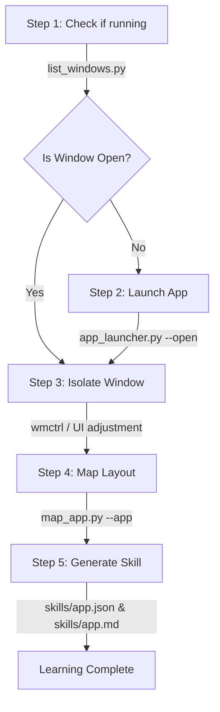

# Skelo — Linux Desktop Automation & Application Mapping Guide

This documentation guides AI agents on how to read, explore, launch, map, and interact with graphical desktop applications under Linux (X11/Cinnamon) using the Skelo toolkit.

---

## Start here: skelo.sh (single entry point)

Every capability in this toolkit is reachable through one script, from any
working directory:

```bash
skelo <command> [args...]          # after the one-line install
./skelo.sh <command> [args...]     # running from a cloned repo
```

Use `skelo`/`skelo.sh`, not the individual python scripts, unless you have
a specific reason to call one directly (e.g. reading `--json` output
through a pipeline that expects the old flag names). It's a thin router —
every subcommand forwards straight to the script that used to require its
own invocation — so nothing about *what* runs changes, only how many
things you have to remember to run it.

| Command | Does |
| :--- | :--- |
| `skelo.sh windows` | What's open right now |
| `skelo.sh apps` | What's installed |
| `skelo.sh open "<name>"` | Launch an installed app |
| `skelo.sh inspect --app "<name>"` | Dump a window's UI elements |
| `skelo.sh learn --app "<name>"` | check→launch→map, one call (start here for a new app) |
| `skelo.sh map --app "<name>"` | Map an already-open app directly |
| `skelo.sh resolve --skill <f> --label "<l>" --click` | Replay a learned skill |
| `skelo.sh click --app "<name>" --label "<l>"` | Click by live label lookup |
| `skelo.sh type --text "..."` | Type text |
| `skelo.sh key --key "ctrl+shift+t"` | Hotkey (join keys with `+`) |
| `skelo.sh minimize / maximize / raise / close --app "<name>"` | Manage a window directly |
| `skelo.sh alt-tab [--times N]` | Cycle windows |
| `skelo.sh doctor` | Check AT-SPI/wmctrl/xdotool/pyautogui/display health |

Run `skelo.sh help` for the full reference, `skelo.sh doctor` any time
something is behaving strangely — most "why didn't that work" cases are a
missing system dependency or accessibility being off, and `doctor` says
exactly which.

## How to act like someone who's actually looking at the screen

The scripts will stop you from doing something *irreversible* by mistake
(map_app.py refuses to map an unconfirmed window, destructive buttons are
skipped, clicks auto-avoid occluded windows) — but good judgment about
*sequencing* is still on you. A person sitting at the keyboard doesn't
click blindly either; they glance at what's in front of them first. Same
idea here:

0. **Determine, raise, confirm, then act — this is enforced, not
   optional.** Whenever you pass `--app`/`--title` to
   `click`/`type`/`key`/`scroll`/`drag`, Skelo raises that window and
   *verifies* it actually became the real, topmost/focused window before
   doing anything else. If it can't confirm that — meaning some other
   window (Chrome, say) may genuinely still have focus — the action
   **refuses outright** rather than send input that could land on the
   wrong app. This is a hard gate, not a best-effort warning:
   `type`/`keypress`/`scroll`/`drag`, and any `click` without a `--label`
   to fall back on, have no safe way to proceed if the target isn't
   confirmed on top, so they don't try:
   ```json
   {"status": "error", "error": "Refusing to run 'type': 'Chrome' could
    not be confirmed as the topmost/focused window...",
    "window_confirmed_topmost": false}
   ```
   The fix is always the same shape: raise the target explicitly
   (`skelo.sh raise --app "<name>"`) and retry. A `click` *with* a
   `--label` is the one exception — it has a genuinely safe fallback (an
   AT-SPI direct action, which activates the control through the
   accessibility API rather than the screen, so it can't hit the wrong
   window no matter what's on top) and uses that automatically instead of
   refusing. If you've independently confirmed the right window has focus
   some other way, `--force` skips the gate — treat that as a deliberate
   override, not a default.
1. **Look before acting.** `skelo.sh windows` costs nothing and tells you
   what's actually open, what's focused, and what might be sitting on top
   of your target. Don't assume state from a previous turn — it may have
   changed.
2. **Clear the way instead of hoping.** If something might be covering
   your target (another app was just focused, multiple windows are open),
   `skelo.sh minimize --app "<blocker>"` or `skelo.sh raise --app "<target>"`
   *before* acting is one call and removes the ambiguity up front, rather
   than finding out from a refusal (point 0 above) or, worse — before that
   gate existed — a misdirected click.
3. **Learn once, replay cheaply.** For any app you'll interact with more
   than once in a session, `skelo.sh learn --app "<name>"` up front, then
   `skelo.sh resolve` for subsequent actions. Don't re-derive coordinates
   from scratch every time the way a first-time user would.
4. **Verify, don't assume success.** After a consequential action, a
   cheap `skelo.sh windows` or `skelo.sh inspect` confirms the intended
   effect actually happened, the same way a person glances back at the
   screen after clicking. Silent trust in "the click probably worked" is
   how small errors compound across a multi-step task.
5. **Ask coordinates to explain themselves.** If you're about to click a
   raw `(x, y)` you got from an earlier `inspect` call, remember it's a
   snapshot — the window may have moved, scrolled, or resized since. Prefer
   `skelo.sh click --app .. --label ..` (live re-resolution) over reusing
   old coordinates, and use `skelo.sh resolve` when you have a learned
   profile and the window may have been resized.

---

## Worked example: "pause Spotify"

A concrete walk-through of the playbook above, because the difference
between "technically has the right tools" and "acts like someone who's
actually looking at the screen" is easiest to see in a real sequence:

```bash
# 1. Look before acting — don't assume Spotify is even open, and don't
#    assume nothing else is on top of it.
skelo windows
# -> shows Spotify open, but NOT the focused window (Chrome is on top)

# 2. Clear the way instead of hoping the click finds it anyway.
skelo raise --app "Spotify"
# -> {"ok": true} only if the raise was actually verified — see below

# 3. Act, targeting the specific control, not just the window.
skelo click --app "Spotify" --label "Pause"

# 4. Verify — don't assume the click landed. A window/inspect re-check
#    (or, for a media app, checking the label flipped to "Play") confirms
#    the actual effect rather than trusting the click's own "clicked":
#    true, which only means the input was sent, not that it did what you
#    expected.
skelo inspect --app "Spotify" --interactive-only
```

Note what's deliberately *not* in that sequence: no raw `--x --y`
coordinates typed from memory, no click fired before confirming the
window was actually raised, and no assumption that step 3 worked without
step 4 checking. Every step is answerable from the previous step's output
— that's the "look, clear, act, verify" loop applied literally.

## Troubleshooting

**Run `skelo doctor` first, always.** It catches the large majority of
"why isn't this working" cases directly — missing AT-SPI bindings,
missing `wmctrl`/`xdotool`, accessibility toggled off, no `DISPLAY`. Read
the specific line it flags rather than re-running the failing command
hoping it resolves itself.

**`AT-SPI GObject bindings not available`** — `python3-gi`/
`gir1.2-atspi-2.0`/`at-spi2-core` aren't installed, or the accessibility
bus isn't enabled. Fix:
```bash
sudo apt install python3-gi gir1.2-atspi-2.0 at-spi2-core
gsettings set org.gnome.desktop.interface toolkit-accessibility true
# then log out/in so already-running apps pick it up
```

**A window op (`minimize`/`maximize`/`raise`/`close`) reports `"ok":
false` with "could not confirm it took effect"** — this is the toolkit
being honest, not broken. It resolved a real window and sent the command,
but couldn't verify the state actually changed (see
[Reliability notes](#reliability-notes) below on why it verifies rather
than trusting the command's exit code). Usually means `xdotool` isn't
installed (`minimize` needs it for a reliable result) or the window
manager doesn't support the requested state — `skelo doctor` will flag
the former.

**`click`/`type`/`key`/`scroll`/`drag` returns `"Refusing to run '<action>':
... could not be confirmed as the topmost/focused window"`** — this is
also intentional, not a bug: it means Skelo genuinely couldn't verify your
target window has real focus, and refused rather than guess (see
[point 0](#how-to-act-like-someone-whos-actually-looking-at-the-screen)
above). Run `skelo.sh raise --app "<name>"` first and retry — if the
raise itself also fails to verify, that's the deeper thing to chase (check
`skelo doctor`, or whether the window manager honors `_NET_ACTIVE_WINDOW`
at all). Don't reach for `--force` as the first fix; it exists for cases
where you've already confirmed focus some other way, not as a way to make
the error go away.

**Files download fine but `skelo windows` (or any command) fails with
`Permission denied` on a file that `ls -l` shows as perfectly readable
(`644`, owned by you)** — this is almost never the permission bits. It's
a POSIX ACL left on the file or inherited from a parent directory's
default ACL, which `ls -l`/`chmod` don't reveal and don't fix. Confirm
with `getfacl <file>` — if you see a `user:`/`group:` entry beyond the
standard owner/group/other lines, that's it. Fix:
```bash
setfacl -b <file>              # clear ACLs on one file
find ~/.skelo-linux -exec setfacl -b {} \;   # clear them across the whole install
```
The one-line installer now does this automatically and verifies every
file is actually readable before reporting success — if you installed via
`install.sh` and still hit this, something *outside* the install
directory (a parent directory's default ACL, or an AppArmor profile) is
the more likely cause; `dmesg | grep -iE 'denied|apparmor'` will usually
name it directly.

**Nothing seems to be running on Wayland** — AT-SPI's window-geometry
reads and `wmctrl`/`xdotool` don't have Wayland equivalents here. Log
into an "…on Xorg" session if your desktop environment offers one.

---


## The Seven Toolkit Scripts (what skelo.sh routes to under the hood)

| Script | What it does | Expected Outputs |
| :--- | :--- | :--- |
| **[skelo_learn.py](file:///home/ciphyrtech/skelo/skelo_learn.py)** | **Recommended entry point for "learn this app."** Runs check-open → launch-if-needed → raise → map as one call, so the sequence can't be partially skipped. | Same success/error JSON as `map_app.py`, plus a `steps` log of what it did. |
| **[list_windows.py](file:///home/ciphyrtech/skelo/list_windows.py)** | Scans all open windows, returns application names, titles, PIDs, and geometries. | JSON containing screen resolution and active window details. |
| **[app_launcher.py](file:///home/ciphyrtech/skelo/app_launcher.py)** | Scans system `.desktop` shortcuts, categorizes applications with index numbers, and launches them. | Index-mapped list or status JSON: `{"status": "success", "launched": "App", "index": 77}`. |
| **[inspect_window.py](file:///home/ciphyrtech/skelo/inspect_window.py)** | Scrapes the accessible element tree of a window. | Flat JSON list of text labels, roles, bounds, and click targets. |
| **[map_app.py](file:///home/ciphyrtech/skelo/map_app.py)** | Confirms the target window's identity against the live open-window list, then iterates through interactive controls, tests click events, and builds a layout skill profile. | A JSON profile (`skills/<app>.json>`) and a Markdown documentation guide (`skills/<app>.md`), or a `status: error` if the target app/window can't be unambiguously confirmed. |
| **[skelo_resolve.py](file:///home/ciphyrtech/skelo/skelo_resolve.py)** | Replays a mapped skill profile, adapting coordinates dynamically to current window geometry. | Execution log verifying resolved click target and click action status. |
| **[skelo_action.py](file:///home/ciphyrtech/skelo/skelo_action.py)** | **Primary Executor**: Performs inputs (clicks, double-clicks, typing, scroll, drag, keypress) by coordinates or live label resolution. | Detailed execution logs indicating movement trajectories and waypoints. |

### Reliability notes

* **`list_windows.py` under rapid repeated calls**: the AT-SPI session bus
  is a single shared resource, so calling this back-to-back in a tight
  agent loop used to occasionally return a bare `"warning"` (or fail
  outright). It now retries the whole scan a couple of times with a short
  backoff before reporting a real error, has timeouts on the `wmctrl` /
  `xwininfo` / `xprop` fallback calls so a hung X call can't stall it, and
  caches its result for `--cache-ttl` seconds (default 0.75s, `0` disables)
  so a rapid loop reuses one fresh scan instead of re-querying every time.
* **`map_app.py` no longer trusts a loose name match.** Previously it
  resolved the target purely via a first-match AT-SPI substring search —
  if that matched the wrong window (or nothing was actually open) it would
  silently map whatever it found and save the profile under *that*
  window's name. It now cross-checks the target against the real
  open-window inventory first and **refuses to map** if: nothing matches,
  the query is ambiguous across multiple apps, or the app has multiple
  windows open and no `--title` was given to disambiguate. This is also
  why `skelo_learn.py` exists — it guarantees that check happens before
  `map_app.py` is ever invoked.
* **Running as root silently corrupted window identification.** AT-SPI
  authenticates by peer UID, so root's connection gets rejected and every
  script fell back to a cruder X11/`/proc/<pid>/comm` path — this is how
  the same PID could be reported as `"Spotify"` under root and
  `"Chromium"` (showing an unrelated video title) under `sudo -u <user>`.
  All scripts now detect they're running as root and automatically
  re-exec themselves as the logged-in desktop user (override with
  `SKELO_DESKTOP_USER=<name>` if auto-detection picks the wrong account).
  You should no longer need to remember `sudo -u` at all — but it's
  harmless to still use it. Window entries also now carry a `"source"`
  field (`"atspi"` vs `"x11_fallback"`), and `map_app.py` attaches an
  `identification_caveat` to its result when a match was only ever
  resolved via the lower-confidence fallback path.
* **`el_N` ids didn't match between `inspect_window.py` and
  `skelo_action.py`.** `inspect_window.py` numbers only "meaningful"
  elements; `skelo_action.py` used to number *every* AT-SPI node, so an
  id copied from one script's output could resolve to a completely
  different element in the other. Both now share the same
  meaningful-element predicate and numbering (in `skelo_common.py`), so an
  `el_N` from `inspect_window.py` can be passed straight into
  `skelo_action.py --element-id` and land on the same element.
* **`map_app.py`'s default `skills/` output is now anchored to the
  script's own directory**, not the caller's current working directory —
  previously, running it from different shells/cwd could scatter saved
  profiles across unrelated `skills/` folders.
* **Window-layering / occlusion fix.** `skelo_action.py` used to raise the
  target window with a single fire-and-forget `wmctrl -a` and then click
  the screen coordinate regardless of whether the raise actually worked.
  If the window manager didn't actually bring the target to the front
  (title mismatch, timing, another window stealing focus), the click
  landed on whatever *was* on top — this was the concrete "asked to pause
  Spotify, agent clicked Chrome" bug. It now calls `ensure_window_topmost()`,
  which raises and re-checks the window's ACTIVE state with a few retries.
  If it still can't confirm the target window is topmost, a `--click`
  automatically prefers the coordinate-independent AT-SPI action click
  (`method="action"`) instead of a screen click, and reports
  `"auto_switched_to_action": true` in the result. If no AT-SPI action
  exists either, it falls back to a cursor click but adds an explicit
  `"occlusion_warning"` field so the caller knows the click was risky —
  it's never silent anymore. You can force the old cursor-only behavior
  with `--method cursor`.
* **New window-management actions on `skelo_action.py`**, so an agent can
  clear overlapping windows directly instead of guessing keypresses:
  `--action minimize|maximize|unmaximize|raise_window|close_window --app "<name>"`
  (or `--title`), and `--action alt_tab [--times N] [--reverse]` for
  Alt+Tab / Alt+Shift+Tab cycling. Ordinary multi-key combos (e.g.
  `Ctrl+Shift+T`) were already supported via
  `--action keypress --key "ctrl+shift+t"` (join keys with `+`) — that's
  unchanged.
* **Window-management commands used to report success without doing
  anything.** The first version of `minimize`/`maximize`/`raise_window`/
  `close_window` handed the raw `--app`/`--title` string straight to
  `wmctrl -r "<string>" ...`. `wmctrl`'s string matching is loose and, if
  it matches zero windows, **still exits 0** — so a typo, or an app whose
  window title doesn't contain its app name (Spotify's window title is
  the current song, not "Spotify"), produced `"ok": true` with no visible
  effect. `window_manage()` now resolves a concrete X11 window id first
  (preferring a pid match via AT-SPI, the same identity-confirmation
  principle `map_app.py` already uses, with a title/`WM_CLASS` fallback),
  operates on that id unambiguously (`wmctrl -i ...`), and then re-reads
  the window's real `_NET_WM_STATE`/`_NET_ACTIVE_WINDOW` to confirm the
  change actually happened before reporting success. If it can't confirm
  after a few retries, it now returns `"ok": false` with a specific error
  instead of a false positive.
* **An untargeted `type` used to click an arbitrary element first.**
  `resolve_element()` treated a bare `--app`/`--title` (with no
  `--label`/`--role`/`--element-id`) as reason enough to search for *and
  click* an element — with no filter applied, every meaningful element
  matched, so `type --app "gnome-calculator" --text "+8="` would click
  whichever button AT-SPI happened to enumerate first (observed: "Undo",
  triggering an unwanted undo). `app`/`title` now only ever mean "target
  this window" — they raise/confirm the window but never trigger an
  element search or click on their own. Only `label`/`role`/`element_id`
  resolve and click a specific element. Practical effect: if a window's
  main input already has focus after being raised (true for most
  single-view apps like a calculator), `skelo.sh type --app "<name>"
  --text "..."` now just types into it safely. If a specific field needs
  focus first, target it explicitly — `skelo.sh click --app "<name>"
  --label "<field>"` before typing, or pass `--label` directly on the
  `type` call itself.
* **Occlusion protection only covered labeled clicks — everything else
  could still hit the wrong window.** The fix above (`ensure_window_topmost`
  + auto-switch to an AT-SPI action click) only applied to `click` calls
  that had a specific `--label` resolved. A `type`, `keypress`, `scroll`,
  `drag`, or an unlabeled coordinate `click` never checked
  `window_confirmed_topmost` at all — they just fired at whatever
  genuinely had OS focus, which is exactly how "play Spotify" could still
  land on Chrome even after the labeled-click fix: the agent's *keypress*
  (spacebar to play/pause) or *unlabeled click* had no protection.
  `run_single_action()` now has a single gate all actions pass through: if
  `--app`/`--title` was given and the window couldn't be confirmed
  topmost, `type`/`keypress`/`scroll`/`drag`/unlabeled-`click` now
  **refuse outright** —
  `{"status": "error", "error": "Refusing to run '<action>': ... could not
  be confirmed as the topmost/focused window..."}` — instead of silently
  sending input that might hit a different app. A labeled `click` still
  uses the safe AT-SPI-action fallback instead of refusing, since that
  option genuinely can't miss. An explicit `"force": true` / `--force`
  bypasses the gate for a caller that has already confirmed focus some
  other way. Covered by `test_topmost_gate.py`.

---

## Detailed Script Manual

### 0. skelo_learn.py (start here)
* **Usage**: `python3 skelo_learn.py --app "<app_name>"` (optional `--title "<window_title>"`, `--skip-launch`, `--launch-wait <seconds>`, `--output <path>`)
* **What it guarantees**: it will not call `map_app.py` until it has itself
  confirmed, via `list_windows.py`'s scan, that the target app is open and
  unambiguous — launching it first via `app_launcher.py` if it wasn't.
  Use this instead of chaining the individual scripts by hand whenever the
  goal is "learn how to use app X"; fall back to running the scripts
  individually only when you need to intervene mid-flow (e.g. the app
  needs manual login before it can be mapped).
* **Output**: identical `status`/`json_profile`/`markdown_profile` fields
  to `map_app.py`, plus a `steps` array documenting what was checked/
  launched/raised, so a failure can be diagnosed without re-running
  everything.

### 1. list_windows.py
* **Usage**: `python3 list_windows.py`
* **Output Format**:
  ```json
  {
    "timestamp": "2026-07-13T15:46:25Z",
    "screen_resolution": {"width": 1920, "height": 1080},
    "windows": [
      {
        "app_name": "nemo",
        "process_id": 11500,
        "window_title": "Home",
        "role": "frame",
        "is_focused": false,
        "bounds": {"x": 984, "y": 0, "width": 936, "height": 1036}
      }
    ]
  }
  ```

### 2. app_launcher.py
* **Usage**:
  * List all installed apps: `python3 app_launcher.py --list` (or `--json` for JSON output)
  * Open an application: `python3 app_launcher.py --open <index_number>` or `python3 app_launcher.py --open <app_name>`
* **Features**:
  * Automatically handles Flatpak sandbox environment blocks when run under `sudo` by stripping `SUDO_` variables and exporting `XDG_RUNTIME_DIR`.
  * Merges space-separated names (e.g. `OBS Studio`) without quotes.
  * Lists matching selections with numbers if input is ambiguous.

### 3. inspect_window.py
* **Usage**: `python3 inspect_window.py --app "<app_name>"`
* **Output Format**:
  ```json
  {
    "app_name": "nemo",
    "window_bounds": {"x": 984, "y": 0, "width": 936, "height": 1036},
    "elements": [
      {
        "id": "el_63",
        "type": "toggle_button",
        "label": "Compact View",
        "bounds": {"x": 1879, "y": 60, "width": 37, "height": 35},
        "clickable": true,
        "click_target": {"x": 1897, "y": 77}
      }
    ]
  }
  ```

### 4. map_app.py
* **Usage**: `python3 map_app.py --app "<app_name>"`
* **Features**:
  * Automatically calls `try_activate_window` before test-clicking to ensure target window is at the top layer.
  * Skips off-screen elements (e.g. `-2147483648`) to avoid mouse trajectory errors.
  * Ignores termination buttons (e.g. `Close`, `Exit`, `Delete`) to prevent app closure or data loss during scanning.

### 5. skelo_resolve.py
* **Usage**: `python3 skelo_resolve.py --skill skills/<app>.json --label "<control_label>" --click`
* **Features**: Recomputes coordinate offsets relative to the window's *current* coordinates using the anchor definitions stored in the skill map.

### 6. skelo_action.py
* **Usage**:
  * Coordinates: `python3 skelo_action.py --action click --x 1000 --y 500`
  * Live Label Resolve: `python3 skelo_action.py --app "nemo" --label "Home" --click`
  * Sequence: `python3 skelo_action.py --sequence '[{"action": "click", "x": 10, "y": 10}, {"action": "type", "text": "test"}]'`
  * Clear an overlapping window: `python3 skelo_action.py --action minimize --app "Chrome"`
  * Restore focus without clicking: `python3 skelo_action.py --action raise_window --app "Spotify"`
  * Cycle windows: `python3 skelo_action.py --action alt_tab --times 2`
* **Supported Inputs**: `click`, `move`, `drag`, `scroll`, `type`, `keypress`, `minimize`, `maximize`, `unmaximize`, `raise_window`, `close_window`, `alt_tab`. Supports options like `--button right`, `--clicks 2` (double-click).

---

## Application Learning Workflow (Step-by-Step)

When instructed to learn/map any application (e.g. OBS Studio, Nemo, or standard desktop tools), **default to a single call**:

```bash
python3 skelo_learn.py --app "<app_name>"
```

This runs every step below in order and cannot be partially skipped. Only
fall back to running the steps manually if you need to intervene between
them (e.g. clicking through a first-run dialog before mapping can safely
begin), or if `skelo_learn.py` returns an error you need to diagnose by
hand. The manual flow: 



### Step 1: Scan Screen Environment
Query the active environment to verify if the application is already running on screen:
```bash
python3 list_windows.py
```
Check if the application name matches the target.

### Step 2: Launch the Target Application (If Not Running)
If the window is missing from the list, open it using the launcher:
```bash
# E.g. Launching OBS Studio
python3 app_launcher.py --open "OBS Studio"
```
Wait 3 to 5 seconds for the application to load and initialize its window canvas.

### Step 3: Isolate and Raise the Window
To prevent mouse clicks from landing on overlapping windows (causing false positives or missing actions):
* Unmaximize other open windows (e.g. Chrome or Spotify) and move them away from the target coordinates using `wmctrl`.
* Keep the target application fully on screen in the active front layer.

### Step 4: Map Application Controls
Run the application mapper script:
```bash
python3 map_app.py --app "<app_name>"
```
This script will safely cycle through all button, menu, and tab controls, clicking each, monitoring GUI state updates, and extracting descriptions.

### Step 5: Save Custom Application Skill
The mapping output yields a reusable profile stored in the `skills/` directory:
1. `skills/<app_name>.json`: Structural coordinates, region, and anchors for programmatic execution.
2. `skills/<app_name>.md`: Human-readable guide explaining the functions of every button and UI layout details.

Use these files in future tasks to control the app with `skelo_resolve.py` without needing to re-scan.
